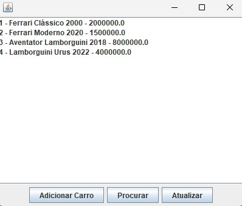

# Projeto utilizando Java

Projeto da cadeira de Técnicas de Implementação de Banco de Dados.
Nesse projeto criamos uma simples aplicação que cadastra e lista carros,
além de validar e registrar usuários.

# Como rodar

- Abra o projeto no VSCode
- Instale o JDK em sua máquina
- Instale a extensão do Java no VSCode
- Execute o arquivo Application.java

# Layouts

### Login

Nessa tela a aplicação pede o usuário e a senha
para que realize uma validação com o banco de dados
e possui o botão para entrar no sistema e para registrar
no caso de o usuário ainda não estar registrado.

### Register

Nessa tela pergunta-se *nome, usuário* e *senha* para que
o usuário seja registrado no banco de dados e assim ter
acesso ao sistema

### Cars Screen

Nessa tela é mostrado todos os carros criados com o id do 
usuário que logou no sistema além de ter três botões, para
adicionar um novo carro, atualizar a tela e para procurar
por um carro, além disso, cada linha de cada carro é interativo
e ao clickar aprece na tela a Option Screen, uma tela onde
o usuário poderá escolher entre remover ou alterar o carro.

### AddCarScreen

Nessa tela é mostrado um formulário com cada informção do carro
novo que o usuário queria adicionar, perguntando *marca, modelo,*
*ano de fabricação e valor* do carro, após preencher o sistema irá
adicionar o carro com o id do usuário como chave estrangeira no
banco de dados.

### Option Screen
;

Na tela Option Screen é mostrado as informações do carro e
3 opções que o usuário pode fazer, alterar informações do 
carro, remover o carro ou voltar.

### Alte rScreen

Em Alter Screen é mostrado um formulário com os campos de
*marca, modelo, ano de fabricação e valor* com os dados atuais
em cada campo, para que o usuário possa alterar qualquer dado
do carro selecionado.

### Search Screen

Nessa tela é mostrado um campo para que o usuário insira o nome
do carro que esteja procurando ou pelo menos parte do nome, após
inserir o sistema redireciona o usuário para uma lista com o nome
inserido pelo usuário.